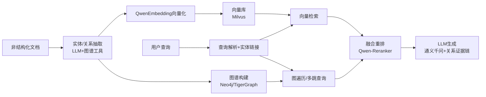

# 企业级RAG知识库系统 - 系统架构设计文档

> 文档版本: v2.0  
> 创建日期: 2026-02-17  
> 文档状态: 正式版  
> 依据文档: 需求分析文档v1.1、技术选型文档v2.2  
> 架构类型: **GraphRAG（知识图谱+向量检索融合架构）**

---

## 目录

- [1. 架构设计概述](#1-架构设计概述)
- [2. GraphRAG核心架构](#2-graphrag核心架构)
- [3. 知识图谱构建模块](#3-知识图谱构建模块)
- [4. 向量检索模块](#4-向量检索模块)
- [5. 图遍历与多跳查询模块](#5-图遍历与多跳查询模块)
- [6. 融合重排模块](#6-融合重排模块)
- [7. LLM生成模块](#7-llm生成模块)
- [8. 系统分层架构](#8-系统分层架构)
- [9. 核心模块设计](#9-核心模块设计)
- [10. 模块间接口定义](#10-模块间接口定义)
- [11. 数据流转流程](#11-数据流转流程)
- [12. 数据库设计](#12-数据库设计)
- [13. 安全架构设计](#13-安全架构设计)
- [14. 性能优化策略](#14-性能优化策略)
- [15. 部署架构设计](#15-部署架构设计)

---

## 1. 架构设计概述

### 1.1 GraphRAG架构简介

本系统采用 **GraphRAG（知识图谱增强检索生成）** 架构，将传统向量检索与知识图谱相结合，实现更精准的知识检索和推理能力。

**核心优势：**

| 优势 | 说明 |
|------|------|
| **多跳推理** | 通过图谱关系链实现复杂问题的多跳推理 |
| **实体关联** | 自动识别实体关系，构建知识网络 |
| **证据链追溯** | 提供可解释的关系证据链 |
| **检索增强** | 向量检索+图遍历双重召回，提升召回率 |
| **精准重排** | Qwen-Reranker融合排序，提升准确率 |

### 1.2 设计原则

| 原则 | 说明 | 实践方式 |
|------|------|---------|
| **高可用性** | 系统可用性 > 99.5% | 多副本部署、故障自动转移、服务降级策略 |
| **高性能** | 响应时间 < 3秒 | 异步处理、缓存策略、流式输出 |
| **高安全性** | 数据安全、权限隔离 | RBAC权限模型、数据加密、审计日志 |
| **高扩展性** | 支持水平扩展 | 微服务架构、无状态设计、容器化部署 |
| **高可维护性** | 易于理解和修改 | 模块化设计、接口标准化、文档完善 |

### 1.3 架构约束条件

| 约束类型 | 约束条件 | 架构影响 |
|---------|---------|---------|
| **业务约束** | 10万+文档、1亿+向量、千万级图谱节点 | 需要分布式存储与索引能力 |
| **性能约束** | 响应 < 3秒、QPS 100+ | 需要高效检索Pipeline |
| **安全约束** | 数据不出内网、权限隔离 | 私有化部署核心服务 |
| **技术约束** | Spring Boot + FastAPI混合架构 | 双语言服务协同设计 |
| **资源约束** | GPU资源有限 | 模型推理需要优化调度 |

### 1.4 架构设计目标

```
┌─────────────────────────────────────────────────────────────────────┐
│                        GraphRAG架构设计目标体系                       │
├─────────────────────────────────────────────────────────────────────┤
│                                                                     │
│   ┌─────────────────────────────────────────────────────────────┐  │
│   │                    业务目标 (Business Goals)                  │  │
│   │  ┌───────────┐  ┌───────────┐  ┌───────────┐  ┌───────────┐ │  │
│   │  │ 知识集中  │  │ 智能问答  │  │ 权限管控  │  │ 价值可视  │ │  │
│   │  │ 管理      │  │ 准确率90% │  │ 细粒度    │  │ 化分析    │ │  │
│   │  └───────────┘  └───────────┘  └───────────┘  └───────────┘ │  │
│   └─────────────────────────────────────────────────────────────┘  │
│                                ↓                                    │
│   ┌─────────────────────────────────────────────────────────────┐  │
│   │                    质量目标 (Quality Goals)                   │  │
│   │  ┌───────────┐  ┌───────────┐  ┌───────────┐  ┌───────────┐ │  │
│   │  │ 可用性    │  │ 性能      │  │ 安全性    │  │ 可维护性  │ │  │
│   │  │ > 99.5%   │  │ < 3秒     │  │ 等保合规  │  │ 模块化    │ │  │
│   │  └───────────┘  └───────────┘  └───────────┘  └───────────┘ │  │
│   └─────────────────────────────────────────────────────────────┘  │
│                                ↓                                    │
│   ┌─────────────────────────────────────────────────────────────┐  │
│   │                    技术目标 (Technical Goals)                 │  │
│   │  ┌───────────┐  ┌───────────┐  ┌───────────┐  ┌───────────┐ │  │
│   │  │ GraphRAG  │  │ 云原生    │  │ AI原生    │  │ 数据驱动  │ │  │
│   │  │ 架构      │  │ 部署      │  │ 设计      │  │ 决策      │ │  │
│   │  └───────────┘  └───────────┘  └───────────┘  └───────────┘ │  │
│   └─────────────────────────────────────────────────────────────┘  │
│                                                                     │
└─────────────────────────────────────────────────────────────────────┘
```

---

## 2. GraphRAG核心架构

### 2.1 核心架构流程图



### 2.2 架构流程说明

| 阶段 | 输入 | 处理过程 | 输出 |
|------|------|---------|------|
| **知识抽取** | 非结构化文档 | LLM+图谱工具进行实体/关系抽取 | 实体列表、关系三元组 |
| **双路索引** | 实体/关系数据 | 向量化 + 图谱构建并行处理 | 向量索引 + 图谱节点/边 |
| **查询解析** | 用户查询 | 查询理解 + 实体链接 | 结构化查询 + 实体ID |
| **双路检索** | 结构化查询 | 向量检索 + 图遍历并行执行 | 候选文档集 + 关系路径 |
| **融合重排** | 双路检索结果 | Qwen-Reranker融合排序 | 重排后的Top-K结果 |
| **答案生成** | 重排结果 + 关系证据 | 通义千问生成答案 | 最终答案 + 证据链 |

### 2.3 GraphRAG vs 传统RAG对比

| 维度 | 传统RAG | GraphRAG |
|------|---------|----------|
| **检索方式** | 纯向量相似度 | 向量检索 + 图遍历融合 |
| **多跳推理** | ❌ 不支持 | ✅ 支持多跳关系推理 |
| **实体关联** | ❌ 无关联 | ✅ 自动构建实体关系网络 |
| **证据链** | ❌ 无 | ✅ 提供可解释的关系证据链 |
| **复杂问题** | 效果一般 | 效果优秀 |
| **简单问题** | 效果良好 | 效果良好 |
| **计算成本** | 较低 | 中等（额外图谱构建成本） |

---

## 3. 知识图谱构建模块

### 3.1 模块架构

```
┌─────────────────────────────────────────────────────────────────────┐
│                       知识图谱构建模块架构                            │
├─────────────────────────────────────────────────────────────────────┤
│                                                                     │
│   ┌─────────────────────────────────────────────────────────────┐  │
│   │                      文档输入层                               │  │
│   │  ┌───────────┐  ┌───────────┐  ┌───────────┐  ┌───────────┐ │  │
│   │  │   PDF     │  │   Word    │  │  Markdown │  │   TXT     │ │  │
│   │  └───────────┘  └───────────┘  └───────────┘  └───────────┘ │  │
│   └─────────────────────────────────────────────────────────────┘  │
│                                ↓                                    │
│   ┌─────────────────────────────────────────────────────────────┐  │
│   │                      文档解析层                               │  │
│   │  ┌───────────┐  ┌───────────┐  ┌───────────┐               │  │
│   │  │ 文本提取  │  │ 段落分割  │  │ 表格解析  │               │  │
│   │  └───────────┘  └───────────┘  └───────────┘               │  │
│   └─────────────────────────────────────────────────────────────┘  │
│                                ↓                                    │
│   ┌─────────────────────────────────────────────────────────────┐  │
│   │                    实体/关系抽取层                            │  │
│   │  ┌───────────────────────────────────────────────────────┐  │  │
│   │  │              LLM抽取引擎 (Qwen2.5-Max)                 │  │  │
│   │  │  ┌─────────────┐  ┌─────────────┐  ┌─────────────┐   │  │  │
│   │  │  │ 实体识别NER │  │ 关系抽取RE  │  │ 属性抽取AE  │   │  │  │
│   │  │  └─────────────┘  └─────────────┘  └─────────────┘   │  │  │
│   │  └───────────────────────────────────────────────────────┘  │  │
│   │  ┌───────────────────────────────────────────────────────┐  │  │
│   │  │              图谱工具增强                              │  │  │
│   │  │  ┌─────────────┐  ┌─────────────┐  ┌─────────────┐   │  │  │
│   │  │  │ GLiNER     │  │ spaCy      │  │ HanLP      │   │  │  │
│   │  │  │ 通用实体识别│  │ 依存分析   │  │ 中文NLP    │   │  │  │
│   │  │  └─────────────┘  └─────────────┘  └─────────────┘   │  │  │
│   │  └───────────────────────────────────────────────────────┘  │  │
│   └─────────────────────────────────────────────────────────────┘  │
│                                ↓                                    │
│   ┌─────────────────────────────────────────────────────────────┐  │
│   │                      图谱存储层                               │  │
│   │  ┌───────────────────────┐  ┌───────────────────────┐      │  │
│   │  │      Neo4j            │  │     TigerGraph        │      │  │
│   │  │  (通用图谱存储)        │  │  (大规模图分析)       │      │  │
│   │  └───────────────────────┘  └───────────────────────┘      │  │
│   └─────────────────────────────────────────────────────────────┘  │
│                                                                     │
└─────────────────────────────────────────────────────────────────────┘
```

### 3.2 实体抽取流程

```python
class EntityExtractor:
    """
    实体抽取器 - 基于LLM的实体识别
    """
    
    EXTRACTION_PROMPT = """
    请从以下文本中抽取实体，按类型分类：
    
    文本：{text}
    
    实体类型：
    - PERSON: 人物
    - ORGANIZATION: 组织机构
    - LOCATION: 地点
    - PRODUCT: 产品
    - EVENT: 事件
    - DATE: 日期
    - CONCEPT: 概念/术语
    
    输出格式（JSON）：
    {{
        "entities": [
            {{"name": "实体名", "type": "类型", "description": "描述"}}
        ]
    }}
    """
    
    def extract(self, text: str) -> List[Entity]:
        entities = self.llm.extract(self.EXTRACTION_PROMPT.format(text=text))
        return self._deduplicate(entities)
```

### 3.3 关系抽取流程

```python
class RelationExtractor:
    """
    关系抽取器 - 基于LLM的关系识别
    """
    
    RELATION_PROMPT = """
    请从以下文本中抽取实体之间的关系：
    
    文本：{text}
    
    已识别实体：{entities}
    
    关系类型：
    - 属于 (BELONGS_TO)
    - 包含 (CONTAINS)
    - 位于 (LOCATED_AT)
    - 创建 (CREATED_BY)
    - 关联 (RELATED_TO)
    - 影响 (AFFECTS)
    - 依赖 (DEPENDS_ON)
    
    输出格式（JSON）：
    {{
        "relations": [
            {{
                "head": "头实体",
                "relation": "关系类型",
                "tail": "尾实体",
                "evidence": "原文证据"
            }}
        ]
    }}
    """
    
    def extract(self, text: str, entities: List[Entity]) -> List[Relation]:
        relations = self.llm.extract(
            self.RELATION_PROMPT.format(text=text, entities=entities)
        )
        return self._validate_relations(relations)
```

### 3.4 图谱Schema设计

```
┌─────────────────────────────────────────────────────────────────────┐
│                       知识图谱Schema设计                              │
├─────────────────────────────────────────────────────────────────────┤
│                                                                     │
│   节点类型 (Node Labels):                                           │
│   ┌─────────────────────────────────────────────────────────────┐  │
│   │  Document        - 文档节点                                  │  │
│   │  Chunk           - 文档片段节点                              │  │
│   │  Entity          - 实体节点                                  │  │
│   │    ├── Person      - 人物                                    │  │
│   │    ├── Organization - 组织机构                               │  │
│   │    ├── Location    - 地点                                    │  │
│   │    ├── Product     - 产品                                    │  │
│   │    ├── Event       - 事件                                    │  │
│   │    └── Concept     - 概念/术语                               │  │
│   └─────────────────────────────────────────────────────────────┘  │
│                                                                     │
│   关系类型 (Relationship Types):                                    │
│   ┌─────────────────────────────────────────────────────────────┐  │
│   │  DOCUMENT_HAS_CHUNK    - 文档包含片段                        │  │
│   │  CHUNK_CONTAINS_ENTITY - 片段包含实体                        │  │
│   │  ENTITY_RELATES_ENTITY - 实体关联实体                        │  │
│   │    ├── BELONGS_TO      - 属于                                │  │
│   │    ├── CONTAINS        - 包含                                │  │
│   │    ├── LOCATED_AT      - 位于                                │  │
│   │    ├── CREATED_BY      - 创建者                              │  │
│   │    ├── AFFECTS         - 影响                                │  │
│   │    └── DEPENDS_ON      - 依赖                                │  │
│   │  SIMILAR_TO            - 相似关系                            │  │
│   └─────────────────────────────────────────────────────────────┘  │
│                                                                     │
│   属性设计 (Properties):                                           │
│   ┌─────────────────────────────────────────────────────────────┐  │
│   │  Document:                                                   │  │
│   │    - id, title, source, created_at, updated_at              │  │
│   │    - doc_type, language, metadata                           │  │
│   │                                                              │  │
│   │  Chunk:                                                      │  │
│   │    - id, content, position, embedding_id                    │  │
│   │    - token_count, hash                                      │  │
│   │                                                              │  │
│   │  Entity:                                                     │  │
│   │    - id, name, type, description                            │  │
│   │    - alias[], embedding_id, confidence                      │  │
│   │                                                              │  │
│   │  Relationship:                                               │  │
│   │    - id, type, evidence, confidence                         │  │
│   │    - source_chunk_id, created_at                            │  │
│   └─────────────────────────────────────────────────────────────┘  │
│                                                                     │
└─────────────────────────────────────────────────────────────────────┘
```

---

## 4. 混合检索模块

### 4.1 模块架构

```
┌─────────────────────────────────────────────────────────────────────┐
│                       混合检索模块架构                                │
├─────────────────────────────────────────────────────────────────────┤
│                                                                     │
│   ┌─────────────────────────────────────────────────────────────┐  │
│   │                    Embedding服务层                            │  │
│   │  ┌───────────────────────────────────────────────────────┐  │  │
│   │  │              Qwen-Embedding                            │  │  │
│   │  │  ┌─────────────┐  ┌─────────────┐  ┌─────────────┐   │  │  │
│   │  │  │ 文本向量化  │  │ 实体向量化  │  │ 查询向量化  │   │  │  │
│   │  │  └─────────────┘  └─────────────┘  └─────────────┘   │  │  │
│   │  │  维度: 1024 | 批量: 32 | 缓存: Redis                 │  │  │
│   │  └───────────────────────────────────────────────────────┘  │  │
│   └─────────────────────────────────────────────────────────────┘  │
│                                ↓                                    │
│   ┌─────────────────────────────────────────────────────────────┐  │
│   │                    双存储层（ES + Milvus）                    │  │
│   │  ┌─────────────────────────┐  ┌─────────────────────────┐  │  │
│   │  │      Elasticsearch      │  │        Milvus           │  │  │
│   │  │  ┌─────────────────┐   │  │  ┌─────────────────┐   │  │  │
│   │  │  │ 关键词索引       │   │  │  │ 文档向量集合     │   │  │  │
│   │  │  │ doc_index       │   │  │  │ doc_vectors      │   │  │  │
│   │  │  └─────────────────┘   │  │  └─────────────────┘   │  │  │
│   │  │  ┌─────────────────┐   │  │  ┌─────────────────┐   │  │  │
│   │  │  │ 元数据索引       │   │  │  │ 实体向量集合     │   │  │  │
│   │  │  │ metadata_index  │   │  │  │ entity_vec       │   │  │  │
│   │  │  └─────────────────┘   │  │  └─────────────────┘   │  │  │
│   │  │  索引: BM25 | 分片: 3  │  │  索引: IVF_FLAT | 分片: 4 │  │  │
│   │  └─────────────────────────┘  └─────────────────────────┘  │  │
│   └─────────────────────────────────────────────────────────────┘  │
│                                ↓                                    │
│   ┌─────────────────────────────────────────────────────────────┐  │
│   │                    检索服务层                                 │  │
│   │  ┌─────────────┐  ┌─────────────┐  ┌─────────────┐         │  │
│   │  │ 关键词检索  │  │ 向量检索    │  │ 混合检索    │         │  │
│   │  │ ES BM25     │  │ Milvus      │  │ RRF融合     │         │  │
│   │  │ top_k=100   │  │ top_k=100   │  │ top_k=20    │         │  │
│   │  └─────────────┘  └─────────────┘  └─────────────┘         │  │
│   └─────────────────────────────────────────────────────────────┘  │
│                                                                     │
└─────────────────────────────────────────────────────────────────────┘
```

### 4.2 Elasticsearch索引配置

```python
class ElasticsearchConfig:
    """
    Elasticsearch索引配置
    """
    
    INDEX_SETTINGS = {
        "number_of_shards": 3,
        "number_of_replicas": 1,
        "analysis": {
            "analyzer": {
                "ik_smart_analyzer": {
                    "type": "custom",
                    "tokenizer": "ik_smart"
                },
                "ik_max_word_analyzer": {
                    "type": "custom",
                    "tokenizer": "ik_max_word"
                }
            }
        }
    }
    
    DOC_MAPPING = {
        "properties": {
            "doc_id": {"type": "keyword"},
            "chunk_id": {"type": "keyword"},
            "content": {
                "type": "text",
                "analyzer": "ik_max_word_analyzer",
                "search_analyzer": "ik_smart_analyzer"
            },
            "title": {
                "type": "text",
                "analyzer": "ik_max_word_analyzer"
            },
            "keywords": {"type": "keyword"},
            "metadata": {
                "properties": {
                    "doc_type": {"type": "keyword"},
                    "category": {"type": "keyword"},
                    "tags": {"type": "keyword"},
                    "created_at": {"type": "date"}
                }
            },
            "milvus_id": {"type": "keyword"}
        }
    }
```

### 4.3 Milvus向量索引配置

```python
class MilvusConfig:
    """
    Milvus向量数据库配置
    """
    
    COLLECTIONS = {
        "doc_chunks": {
            "description": "文档片段向量集合",
            "dimension": 1024,
            "index_type": "IVF_FLAT",
            "metric_type": "COSINE",
            "params": {"nlist": 1024},
            "schema": {
                "id": "INT64",
                "embedding": "FLOAT_VECTOR(1024)",
                "doc_id": "VARCHAR(64)",
                "chunk_id": "VARCHAR(64)",
                "content": "VARCHAR(8192)",
                "es_id": "VARCHAR(64)",
                "metadata": "JSON"
            }
        },
        "entities": {
            "description": "实体向量集合",
            "dimension": 1024,
            "index_type": "IVF_FLAT",
            "metric_type": "COSINE",
            "params": {"nlist": 512},
            "schema": {
                "id": "INT64",
                "embedding": "FLOAT_VECTOR(1024)",
                "entity_id": "VARCHAR(64)",
                "entity_name": "VARCHAR(256)",
                "entity_type": "VARCHAR(64)"
            }
        }
    }
```

### 4.4 混合检索策略

| 检索类型 | 适用场景 | 参数配置 | 优势 |
|---------|---------|---------|------|
| **关键词检索** | 精确匹配、专业术语 | BM25, top_k=100 | 精确匹配、可控性强 |
| **向量检索** | 语义相似、模糊查询 | COSINE, top_k=100 | 语义理解、同义召回 |
| **混合检索** | 通用场景 | RRF融合, k=60 | 召回率提升10-15% |
| **过滤检索** | 按条件筛选 | metadata过滤 + 混合检索 | 精准过滤、高效检索 |
| **实体检索** | 实体链接 | 实体向量集合 + 阈值0.85 | 实体消歧、关联查询 |

### 4.5 RRF融合算法

```python
class RRFFusionStrategy:
    """
    Reciprocal Rank Fusion 融合策略
    """
    
    def fuse(
        self,
        keyword_results: List[SearchResult],
        vector_results: List[SearchResult],
        k: int = 60
    ) -> List[SearchResult]:
        """
        RRF融合算法实现
        
        公式: RRF(d) = Σ 1/(k + rank(d))
        
        Args:
            keyword_results: ES关键词检索结果
            vector_results: Milvus向量检索结果
            k: RRF参数，默认60
        
        Returns:
            融合后的排序结果
        """
        scores = defaultdict(float)
        
        for rank, result in enumerate(keyword_results, 1):
            scores[result.doc_id] += 1.0 / (k + rank)
        
        for rank, result in enumerate(vector_results, 1):
            scores[result.doc_id] += 1.0 / (k + rank)
        
        return sorted(
            [{"doc_id": k, "score": v} for k, v in scores.items()],
            key=lambda x: x["score"],
            reverse=True
        )
```

### 4.6 混合检索性能指标

| 指标 | 目标值 | 说明 |
|------|--------|------|
| **召回率提升** | 10-15% | 相比单一向量检索 |
| **查询延迟** | < 100ms | 混合检索总延迟 |
| **ES检索延迟** | < 20ms | 关键词检索 |
| **Milvus检索延迟** | < 50ms | 向量检索 |
| **融合计算延迟** | < 10ms | RRF算法 |
| **并发QPS** | 200+ | 混合检索并发能力 |

### 4.7 混合检索技术优势

| 优势 | 说明 |
|------|------|
| **关键词精确匹配** | ES BM25算法支持精确关键词匹配，专业术语检索效果更佳 |
| **语义相似检索** | Milvus向量检索支持语义理解，同义词、近义词召回能力强 |
| **混合召回增强** | RRF融合算法综合两种检索优势，召回率提升10-15% |
| **复杂过滤支持** | ES支持丰富的过滤条件，metadata过滤效率高 |
| **成熟生态** | ES拥有成熟的运维工具和监控体系 |

---

## 5. 图遍历与多跳查询模块

### 5.1 模块架构

```
┌─────────────────────────────────────────────────────────────────────┐
│                     图遍历与多跳查询模块架构                          │
├─────────────────────────────────────────────────────────────────────┤
│                                                                     │
│   ┌─────────────────────────────────────────────────────────────┐  │
│   │                    查询解析层                                 │  │
│   │  ┌─────────────┐  ┌─────────────┐  ┌─────────────┐         │  │
│   │  │ 意图识别    │  │ 实体链接    │  │ 关系推断    │         │  │
│   │  │ Qwen2.5-Max │  │ 实体消歧    │  │ 路径规划    │         │  │
│   │  └─────────────┘  └─────────────┘  └─────────────┘         │  │
│   └─────────────────────────────────────────────────────────────┘  │
│                                ↓                                    │
│   ┌─────────────────────────────────────────────────────────────┐  │
│   │                    图遍历引擎                                 │  │
│   │  ┌───────────────────────────────────────────────────────┐  │  │
│   │  │              Neo4j / TigerGraph                        │  │  │
│   │  │  ┌─────────────┐  ┌─────────────┐  ┌─────────────┐   │  │  │
│   │  │  │ BFS遍历     │  │ DFS遍历     │  │ 最短路径    │   │  │  │
│   │  │  │ 广度优先    │  │ 深度优先    │  │ Dijkstra    │   │  │  │
│   │  │  └─────────────┘  └─────────────┘  └─────────────┘   │  │  │
│   │  │  ┌─────────────┐  ┌─────────────┐  ┌─────────────┐   │  │  │
│   │  │  │ 多跳查询    │  │ 子图匹配    │  │ 社区发现    │   │  │  │
│   │  │  │ 2-4跳      │  │ Pattern     │  │ Louvain     │   │  │  │
│   │  │  └─────────────┘  └─────────────┘  └─────────────┘   │  │  │
│   │  └───────────────────────────────────────────────────────┘  │  │
│   └─────────────────────────────────────────────────────────────┘  │
│                                ↓                                    │
│   ┌─────────────────────────────────────────────────────────────┐  │
│   │                    结果聚合层                                 │  │
│   │  ┌─────────────┐  ┌─────────────┐  ┌─────────────┐         │  │
│   │  │ 路径打分    │  │ 证据链构建  │  │ 结果排序    │         │  │
│   │  │ 路径权重    │  │ 关系证据    │  │ 相关性排序  │         │  │
│   │  └─────────────┘  └─────────────┘  └─────────────┘         │  │
│   └─────────────────────────────────────────────────────────────┘  │
│                                                                     │
└─────────────────────────────────────────────────────────────────────┘
```

### 5.2 多跳查询示例

```cypher
-- Cypher查询示例：查找与某实体相关的所有文档（2跳）

MATCH path = (start:Entity {name: $entity_name})-[*1..2]-(related:Entity)
WHERE all(r IN relationships(path) WHERE r.confidence > 0.7)
MATCH (related)-[:CHUNK_CONTAINS_ENTITY]->(chunk:Chunk)
MATCH (chunk)<-[:DOCUMENT_HAS_CHUNK]-(doc:Document)
RETURN 
    doc.id as doc_id,
    doc.title as doc_title,
    [n IN nodes(path) | n.name] as entity_path,
    [r IN relationships(path) | type(r)] as relation_path,
    length(path) as hop_count
ORDER BY hop_count, length(path)
LIMIT 50
```

### 5.3 查询类型与策略

| 查询类型 | 示例问题 | 图遍历策略 | 跳数限制 |
|---------|---------|-----------|---------|
| **单实体查询** | "张三的职位是什么？" | 实体属性查询 | 1跳 |
| **关系查询** | "张三和李四是什么关系？" | 双向路径查找 | 2-3跳 |
| **影响分析** | "A项目影响了哪些系统？" | 出度遍历 | 2-4跳 |
| **依赖追溯** | "B模块依赖哪些组件？" | 入度遍历 | 2-4跳 |
| **关联分析** | "这些概念有什么关联？" | 子图匹配 | 3-5跳 |

---

## 6. 融合重排模块

### 6.1 模块架构

```
┌─────────────────────────────────────────────────────────────────────┐
│                       融合重排模块架构                                │
├─────────────────────────────────────────────────────────────────────┤
│                                                                     │
│   ┌─────────────────────────────────────────────────────────────┐  │
│   │                    结果输入层                                 │  │
│   │  ┌───────────────────────┐  ┌───────────────────────┐      │  │
│   │  │    向量检索结果       │  │    图遍历结果         │      │  │
│   │  │  - 文档片段列表       │  │  - 关系路径列表       │      │  │
│   │  │  - 相似度分数         │  │  - 证据链             │      │  │
│   │  │  - Top-100候选        │  │  - Top-50路径         │      │  │
│   │  └───────────────────────┘  └───────────────────────┘      │  │
│   └─────────────────────────────────────────────────────────────┘  │
│                                ↓                                    │
│   ┌─────────────────────────────────────────────────────────────┐  │
│   │                    融合层                                     │  │
│   │  ┌───────────────────────────────────────────────────────┐  │  │
│   │  │              结果去重与合并                            │  │  │
│   │  │  - 基于doc_id去重                                     │  │  │
│   │  │  - 合并向量分数和图路径分数                           │  │  │
│   │  │  - 构建统一候选列表                                   │  │  │
│   │  └───────────────────────────────────────────────────────┘  │  │
│   └─────────────────────────────────────────────────────────────┘  │
│                                ↓                                    │
│   ┌─────────────────────────────────────────────────────────────┐  │
│   │                    重排层                                     │  │
│   │  ┌───────────────────────────────────────────────────────┐  │  │
│   │  │              Qwen-Reranker                            │  │  │
│   │  │  模型: Qwen2.5-Reranker                               │  │  │
│   │  │  输入: Query + [Candidate Docs]                       │  │  │
│   │  │  输出: 重排分数列表                                   │  │  │
│   │  │  批量: 32 | 最大长度: 8192 tokens                     │  │  │
│   │  └───────────────────────────────────────────────────────┘  │  │
│   └─────────────────────────────────────────────────────────────┘  │
│                                ↓                                    │
│   ┌─────────────────────────────────────────────────────────────┐  │
│   │                    输出层                                     │  │
│   │  ┌─────────────┐  ┌─────────────┐  ┌─────────────┐         │  │
│   │  │ Top-K结果   │  │ 证据链      │  │ 置信度分数  │         │  │
│   │  │ K=10-20     │  │ 关系路径    │  │ 综合评分    │         │  │
│   │  └─────────────┘  └─────────────┘  └─────────────┘         │  │
│   └─────────────────────────────────────────────────────────────┘  │
│                                                                     │
└─────────────────────────────────────────────────────────────────────┘
```

### 6.2 Qwen-Reranker配置

```python
class QwenRerankerConfig:
    """
    Qwen-Reranker配置
    """
    
    MODEL_NAME = "Qwen/Qwen2.5-Reranker"
    
    INFERENCE_CONFIG = {
        "max_length": 8192,
        "batch_size": 32,
        "temperature": 1.0,
        "use_fp16": True
    }
    
    RERANK_PROMPT = """
    请根据查询与文档的相关性进行打分（0-1分）：
    
    查询：{query}
    
    文档：{document}
    
    评分标准：
    - 1.0: 完全相关，直接回答问题
    - 0.8: 高度相关，包含关键信息
    - 0.6: 部分相关，有辅助信息
    - 0.4: 弱相关，信息有限
    - 0.2: 几乎不相关
    - 0.0: 完全不相关
    
    输出格式：{{"score": 分数, "reason": "理由"}}
    """
```

### 6.3 融合策略

| 策略 | 公式 | 适用场景 |
|------|------|---------|
| **加权融合** | `score = α*vec_score + β*graph_score` | 通用场景 |
| **倒数排名融合** | `RRF(d) = Σ 1/(k + rank(d))` | 多源异构 |
| **最大值融合** | `score = max(vec_score, graph_score)` | 高召回场景 |
| **乘法融合** | `score = vec_score * graph_score` | 高精度场景 |

---

## 7. LLM生成模块

### 7.1 模块架构

```
┌─────────────────────────────────────────────────────────────────────┐
│                       LLM生成模块架构                                │
├─────────────────────────────────────────────────────────────────────┤
│                                                                     │
│   ┌─────────────────────────────────────────────────────────────┐  │
│   │                    上下文构建层                               │  │
│   │  ┌───────────────────────────────────────────────────────┐  │  │
│   │  │              Prompt模板构建                            │  │  │
│   │  │  ┌─────────────┐  ┌─────────────┐  ┌─────────────┐   │  │  │
│   │  │  │ 系统提示    │  │ 检索上下文  │  │ 证据链展示  │   │  │  │
│   │  │  │ 角色定义    │  │ Top-K文档   │  │ 关系路径    │   │  │  │
│   │  │  └─────────────┘  └─────────────┘  └─────────────┘   │  │  │
│   │  └───────────────────────────────────────────────────────┘  │  │
│   └─────────────────────────────────────────────────────────────┘  │
│                                ↓                                    │
│   ┌─────────────────────────────────────────────────────────────┐  │
│   │                    LLM推理层                                  │  │
│   │  ┌───────────────────────────────────────────────────────┐  │  │
│   │  │              Qwen2.5-Max (主力)                        │  │  │
│   │  │  API: 阿里云DashScope                                  │  │  │
│   │  │  模型: qwen-max                                        │  │  │
│   │  │  上下文: 32K tokens                                    │  │  │
│   │  └───────────────────────────────────────────────────────┘  │  │
│   │  ┌───────────────────────────────────────────────────────┐  │  │
│   │  │              Qwen2.5-72B (本地备用)                    │  │  │
│   │  │  部署: vLLM/TGI                                        │  │  │
│   │  │  GPU: 4x A100 80GB                                     │  │  │
│   │  │  上下文: 32K tokens                                    │  │  │
│   │  └───────────────────────────────────────────────────────┘  │  │
│   └─────────────────────────────────────────────────────────────┘  │
│                                ↓                                    │
│   ┌─────────────────────────────────────────────────────────────┐  │
│   │                    输出处理层                                 │  │
│   │  ┌─────────────┐  ┌─────────────┐  ┌─────────────┐         │  │
│   │  │ 流式输出    │  │ 引用标注    │  │ 格式化      │         │  │
│   │  │ SSE/WebSocket│  │ 来源链接    │  │ Markdown    │         │  │
│   │  └─────────────┘  └─────────────┘  └─────────────┘         │  │
│   └─────────────────────────────────────────────────────────────┘  │
│                                                                     │
└─────────────────────────────────────────────────────────────────────┘
```

### 7.2 Prompt模板设计

```python
class GraphRAGPromptTemplate:
    """
    GraphRAG专用Prompt模板
    """
    
    SYSTEM_PROMPT = """
    你是一个专业的企业知识库助手，基于检索到的文档和知识图谱关系来回答问题。
    
    回答要求：
    1. 基于提供的上下文和证据链进行回答
    2. 如果涉及实体关系，说明关系路径
    3. 引用来源文档，标注引用编号
    4. 如果信息不足，诚实说明
    5. 回答要准确、简洁、专业
    """
    
    USER_PROMPT = """
    ## 用户问题
    {query}
    
    ## 检索到的相关文档
    {contexts}
    
    ## 知识图谱证据链
    {evidence_chains}
    
    ## 回答要求
    请基于以上信息回答用户问题，并标注引用来源。
    如果涉及实体关系，请说明关系路径。
    """
    
    EVIDENCE_CHAIN_TEMPLATE = """
    ### 证据链 {index}
    **路径**: {entity_path}
    **关系**: {relation_path}
    **来源**: {source_doc}
    **置信度**: {confidence}
    """
```

### 7.3 证据链展示格式

```
┌─────────────────────────────────────────────────────────────────────┐
│                        证据链示例展示                                │
├─────────────────────────────────────────────────────────────────────┤
│                                                                     │
│   问题：张三参与了哪些项目？                                         │
│                                                                     │
│   证据链1:                                                           │
│   ┌─────────────────────────────────────────────────────────────┐  │
│   │  [张三] --属于--> [研发部] --负责--> [A项目]                 │  │
│   │                                                              │  │
│   │  来源: 《组织架构文档》第3章                                  │  │
│   │  置信度: 0.95                                                │  │
│   └─────────────────────────────────────────────────────────────┘  │
│                                                                     │
│   证据链2:                                                           │
│   ┌─────────────────────────────────────────────────────────────┐  │
│   │  [张三] --创建--> [B系统] --依赖--> [C组件]                  │  │
│   │                                                              │  │
│   │  来源: 《技术架构文档》第5章                                  │  │
│   │  置信度: 0.88                                                │  │
│   └─────────────────────────────────────────────────────────────┘  │
│                                                                     │
└─────────────────────────────────────────────────────────────────────┘
```

---

## 8. 系统分层架构

### 8.1 分层架构总览

```
┌─────────────────────────────────────────────────────────────────────────────────┐
│                        企业级GraphRAG知识库系统总体架构                           │
├─────────────────────────────────────────────────────────────────────────────────┤
│                                                                                 │
│  ┌───────────────────────────────────────────────────────────────────────────┐ │
│  │                            展现层 (Presentation Layer)                      │ │
│  │  ┌─────────────────┐  ┌─────────────────┐  ┌─────────────────┐           │ │
│  │  │    Web应用      │  │   移动端H5      │  │    管理后台     │           │ │
│  │  │  React 18       │  │  React Mobile   │  │  Ant Design Pro │           │ │
│  │  │  Ant Design     │  │  Ant Mobile     │  │                 │           │ │
│  │  └─────────────────┘  └─────────────────┘  └─────────────────┘           │ │
│  └───────────────────────────────────────────────────────────────────────────┘ │
│                                       ↓                                         │
│  ┌───────────────────────────────────────────────────────────────────────────┐ │
│  │                            网关层 (Gateway Layer)                          │ │
│  │  ┌─────────────────┐  ┌─────────────────┐  ┌─────────────────┐           │ │
│  │  │    APISIX       │  │   认证鉴权      │  │   流量控制      │           │ │
│  │  │  路由/负载均衡  │  │  JWT/OAuth2     │  │  限流/熔断/降级 │           │ │
│  │  └─────────────────┘  └─────────────────┘  └─────────────────┘           │ │
│  └───────────────────────────────────────────────────────────────────────────┘ │
│                                       ↓                                         │
│  ┌───────────────────────────────────────────────────────────────────────────┐ │
│  │                          业务服务层 (Business Layer)                       │ │
│  │  ┌─────────────────────────────────────────────────────────────────────┐ │ │
│  │  │                    Spring Boot 3 业务服务集群                        │ │ │
│  │  │  ┌───────────┐ ┌───────────┐ ┌───────────┐ ┌───────────┐           │ │ │
│  │  │  │ 用户服务  │ │ 文档服务  │ │ 权限服务  │ │ 系统服务  │           │ │ │
│  │  │  │ user-svc  │ │ doc-svc   │ │ auth-svc  │ │ sys-svc   │           │ │ │
│  │  │  └───────────┘ └───────────┘ └───────────┘ └───────────┘           │ │ │
│  │  │  ┌───────────┐ ┌───────────┐ ┌───────────┐ ┌───────────┐           │ │ │
│  │  │  │ 对话服务  │ │ 检索服务  │ │ 审计服务  │ │ 统计服务  │           │ │ │
│  │  │  │ chat-svc  │ │ search-svc│ │ audit-svc │ │ stat-svc  │           │ │ │
│  │  └─────────────────────────────────────────────────────────────────────┘ │ │
│  └───────────────────────────────────────────────────────────────────────────┘ │
│                                       ↓                                         │
│  ┌───────────────────────────────────────────────────────────────────────────┐ │
│  │                         GraphRAG服务层 (AI Service Layer)                  │ │
│  │  ┌─────────────────────────────────────────────────────────────────────┐ │ │
│  │  │                      FastAPI GraphRAG服务集群                        │ │ │
│  │  │  ┌───────────┐ ┌───────────┐ ┌───────────┐ ┌───────────┐           │ │ │
│  │  │  │ 文档解析  │ │ 实体抽取  │ │ 关系抽取  │ │ 图谱构建  │           │ │ │
│  │  │  │ parse-svc │ │ ner-svc   │ │ re-svc    │ │ kg-build  │           │ │ │
│  │  │  └───────────┘ └───────────┘ └───────────┘ └───────────┘           │ │ │
│  │  │  ┌───────────┐ ┌───────────┐ ┌───────────┐ ┌───────────┐           │ │ │
│  │  │  │ Embedding │ │ 向量检索  │ │ 图遍历    │ │ 融合重排  │           │ │ │
│  │  │  │ embed-svc │ │ vec-svc   │ │ graph-svc │ │ rerank-svc│           │ │ │
│  │  │  └───────────┘ └───────────┘ └───────────┘ └───────────┘           │ │ │
│  │  │  ┌───────────┐ ┌───────────┐ ┌───────────┐                        │ │ │
│  │  │  │ LLM推理   │ │ 对话管理  │ │ 查询解析  │                        │ │ │
│  │  │  │ llm-svc   │ │ dialog-svc│ │ query-svc │                        │ │ │
│  │  │  └───────────┘ └───────────┘ └───────────┘                        │ │ │
│  │  └─────────────────────────────────────────────────────────────────────┘ │ │
│  └───────────────────────────────────────────────────────────────────────────┘ │
│                                       ↓                                         │
│  ┌───────────────────────────────────────────────────────────────────────────┐ │
│  │                          中间件层 (Middleware Layer)                       │ │
│  │  ┌─────────────────┐  ┌─────────────────┐  ┌─────────────────┐           │ │
│  │  │     Kafka       │  │     Redis       │  │    XXL-Job      │           │ │
│  │  │   消息队列      │  │   缓存/会话     │  │   任务调度      │           │ │
│  │  └─────────────────┘  └─────────────────┘  └─────────────────┘           │ │
│  └───────────────────────────────────────────────────────────────────────────┘ │
│                                       ↓                                         │
│  ┌───────────────────────────────────────────────────────────────────────────┐ │
│  │                          数据存储层 (Data Layer)                           │ │
│  │  ┌─────────────────┐  ┌─────────────────┐  ┌─────────────────┐           │ │
│  │  │   PostgreSQL    │  │     Milvus      │  │     MinIO       │           │ │
│  │  │   关系数据库    │  │   向量数据库    │  │   对象存储      │           │ │
│  │  └─────────────────┘  └─────────────────┘  └─────────────────┘           │ │
│  │  ┌─────────────────┐  ┌─────────────────┐  ┌─────────────────┐           │ │
│  │  │ Elasticsearch   │  │     Neo4j       │  │   TigerGraph    │           │ │
│  │  │  关键词索引库   │  │   知识图谱      │  │   大规模图分析  │           │ │
│  │  └─────────────────┘  └─────────────────┘  └─────────────────┘           │ │
│  └───────────────────────────────────────────────────────────────────────────┘ │
│                                                                                 │
└─────────────────────────────────────────────────────────────────────────────────┘
```

### 8.2 技术栈清单

| 层级 | 技术组件 | 版本 | 说明 |
|------|---------|------|------|
| **前端** | React | 18.x | 前端框架 |
| | Ant Design Pro | 6.x | 企业级UI组件库 |
| | TypeScript | 5.x | 类型安全 |
| | Vite | 5.x | 构建工具 |
| **后端-业务** | Spring Boot | 3.2.x | 主业务框架 |
| | Spring Security | 6.x | 安全框架 |
| | MyBatis Plus | 3.5.x | ORM框架 |
| | Java | 17+ | 编程语言 |
| **后端-AI** | FastAPI | 0.110+ | GraphRAG服务框架 |
| | Python | 3.11+ | 编程语言 |
| | LlamaIndex | 0.10+ | RAG框架 |
| | LangChain | 0.1+ | Agent框架 |
| **数据库** | PostgreSQL | 15+ | 关系数据库 |
| | Milvus | 2.3+ | 向量数据库 |
| | Elasticsearch | 8.x | 关键词索引库 |
| | Neo4j | 5.x | 知识图谱数据库 |
| | TigerGraph | 3.x | 大规模图分析 |
| | Redis | 7.x | 缓存数据库 |
| | MinIO | RELEASE.2024+ | 对象存储 |
| **中间件** | Kafka | 3.6+ | 消息队列 |
| | APISIX | 3.x | API网关 |
| | XXL-Job | 2.4+ | 任务调度 |
| **AI服务** | Qwen-Embedding | latest | Embedding模型 |
| | Qwen-Reranker | latest | 重排模型 |
| | Qwen2.5-Max | latest | 主力LLM（API） |
| | Qwen2.5-72B | latest | 本地LLM（高安全场景） |
| **运维** | Kubernetes | 1.28+ | 容器编排 |
| | Docker | 24+ | 容器运行时 |
| | Prometheus | 2.x | 监控系统 |
| | Grafana | 10.x | 可视化 |
| | ELK Stack | 8.x | 日志系统 |

---

## 9. 核心模块设计

### 9.1 文档处理模块

```
┌─────────────────────────────────────────────────────────────────────┐
│                       文档处理模块设计                                │
├─────────────────────────────────────────────────────────────────────┤
│                                                                     │
│   功能职责：                                                         │
│   ├── 文档上传与解析                                                 │
│   ├── 文档分块与预处理                                               │
│   ├── 文档元数据管理                                                 │
│   └── 文档版本控制                                                   │
│                                                                     │
│   核心接口：                                                         │
│   ┌─────────────────────────────────────────────────────────────┐  │
│   │  POST   /api/v1/documents/upload      # 文档上传            │  │
│   │  GET    /api/v1/documents/{id}        # 获取文档详情        │  │
│   │  DELETE /api/v1/documents/{id}        # 删除文档            │  │
│   │  POST   /api/v1/documents/parse       # 触发文档解析        │  │
│   │  GET    /api/v1/documents/{id}/status # 获取处理状态        │  │
│   └─────────────────────────────────────────────────────────────┘  │
│                                                                     │
│   处理流程：                                                         │
│   文档上传 → 格式检测 → 文本提取 → 分块处理 → 向量化 → 图谱构建     │
│                                                                     │
└─────────────────────────────────────────────────────────────────────┘
```

### 9.2 知识图谱模块

```
┌─────────────────────────────────────────────────────────────────────┐
│                       知识图谱模块设计                                │
├─────────────────────────────────────────────────────────────────────┤
│                                                                     │
│   功能职责：                                                         │
│   ├── 实体识别与抽取                                                 │
│   ├── 关系抽取与验证                                                 │
│   ├── 图谱存储与索引                                                 │
│   ├── 图谱查询与遍历                                                 │
│   └── 图谱可视化                                                     │
│                                                                     │
│   核心接口：                                                         │
│   ┌─────────────────────────────────────────────────────────────┐  │
│   │  POST   /api/v1/kg/extract            # 触发知识抽取        │  │
│   │  GET    /api/v1/kg/entities           # 实体查询            │  │
│   │  GET    /api/v1/kg/relations          # 关系查询            │  │
│   │  POST   /api/v1/kg/traverse           # 图遍历查询          │  │
│   │  GET    /api/v1/kg/path               # 路径查询            │  │
│   │  GET    /api/v1/kg/subgraph           # 子图查询            │  │
│   └─────────────────────────────────────────────────────────────┘  │
│                                                                     │
│   图谱操作：                                                         │
│   实体创建 → 关系建立 → 属性更新 → 图遍历 → 路径查找 → 子图匹配     │
│                                                                     │
└─────────────────────────────────────────────────────────────────────┘
```

### 9.3 检索模块

```
┌─────────────────────────────────────────────────────────────────────┐
│                       检索模块设计                                    │
├─────────────────────────────────────────────────────────────────────┤
│                                                                     │
│   功能职责：                                                         │
│   ├── 向量检索                                                       │
│   ├── 图遍历检索                                                     │
│   ├── 混合检索                                                       │
│   ├── 结果融合重排                                                   │
│   └── 检索缓存                                                       │
│                                                                     │
│   核心接口：                                                         │
│   ┌─────────────────────────────────────────────────────────────┐  │
│   │  POST   /api/v1/search/vector         # 向量检索            │  │
│   │  POST   /api/v1/search/graph          # 图遍历检索          │  │
│   │  POST   /api/v1/search/hybrid         # 混合检索            │  │
│   │  POST   /api/v1/search/rerank         # 结果重排            │  │
│   │  GET    /api/v1/search/cache/{query}  # 缓存查询            │  │
│   └─────────────────────────────────────────────────────────────┘  │
│                                                                     │
│   检索流程：                                                         │
│   查询解析 → 实体链接 → 双路检索 → 结果融合 → 重排序 → 返回结果     │
│                                                                     │
└─────────────────────────────────────────────────────────────────────┘
```

### 9.4 问答模块

```
┌─────────────────────────────────────────────────────────────────────┐
│                       问答模块设计                                    │
├─────────────────────────────────────────────────────────────────────┤
│                                                                     │
│   功能职责：                                                         │
│   ├── 问题理解与解析                                                 │
│   ├── 上下文构建                                                     │
│   ├── LLM答案生成                                                    │
│   ├── 流式输出                                                       │
│   └── 对话历史管理                                                   │
│                                                                     │
│   核心接口：                                                         │
│   ┌─────────────────────────────────────────────────────────────┐  │
│   │  POST   /api/v1/chat/completions      # 问答请求            │  │
│   │  POST   /api/v1/chat/stream           # 流式问答            │  │
│   │  GET    /api/v1/chat/history/{sid}    # 对话历史            │  │
│   │  DELETE /api/v1/chat/session/{sid}    # 清除会话            │  │
│   │  POST   /api/v1/chat/feedback         # 反馈提交            │  │
│   └─────────────────────────────────────────────────────────────┘  │
│                                                                     │
│   问答流程：                                                         │
│   问题接收 → 查询解析 → 检索召回 → 上下文构建 → LLM生成 → 流式输出  │
│                                                                     │
└─────────────────────────────────────────────────────────────────────┘
```

---

## 10. 模块间接口定义

### 10.1 服务间通信协议

| 通信方式 | 适用场景 | 协议格式 |
|---------|---------|---------|
| **REST API** | 同步请求、简单查询 | JSON over HTTP |
| **gRPC** | 高性能内部调用 | Protocol Buffers |
| **Kafka** | 异步任务、事件驱动 | JSON/Avro消息 |
| **WebSocket** | 流式输出、实时推送 | 文本/二进制帧 |

### 10.2 核心API接口定义

#### 10.2.1 文档上传接口

```yaml
POST /api/v1/documents/upload
Content-Type: multipart/form-data

Request:
  file: binary           # 文档文件
  metadata:              # 元数据（可选）
    title: string
    category: string
    tags: array
    access_level: string

Response:
  {
    "code": 200,
    "data": {
      "doc_id": "doc_abc123",
      "status": "pending",
      "message": "文档已上传，等待处理"
    }
  }
```

#### 10.2.2 GraphRAG检索接口

```yaml
POST /api/v1/search/hybrid
Content-Type: application/json

Request:
  {
    "query": "张三参与了哪些项目？",
    "options": {
      "vector_search": {
        "top_k": 100,
        "threshold": 0.7
      },
      "graph_search": {
        "max_hops": 3,
        "entity_types": ["Person", "Project"]
      },
      "rerank": {
        "model": "qwen-reranker",
        "top_k": 10
      }
    }
  }

Response:
  {
    "code": 200,
    "data": {
      "results": [
        {
          "doc_id": "doc_xyz",
          "content": "相关文档内容...",
          "score": 0.95,
          "evidence_chains": [
            {
              "path": ["张三", "研发部", "A项目"],
              "relations": ["属于", "负责"],
              "confidence": 0.92
            }
          ]
        }
      ],
      "total": 10,
      "query_time_ms": 156
    }
  }
```

#### 10.2.3 问答接口

```yaml
POST /api/v1/chat/completions
Content-Type: application/json

Request:
  {
    "query": "张三参与了哪些项目？",
    "session_id": "session_123",
    "options": {
      "stream": true,
      "show_evidence": true,
      "max_tokens": 2048
    }
  }

Response (Stream):
  data: {"content": "根据", "done": false}
  data: {"content": "知识库", "done": false}
  data: {"content": "记录...", "done": false}
  ...
  data: {
    "content": "",
    "done": true,
    "references": [
      {"doc_id": "doc_1", "title": "组织架构文档"}
    ],
    "evidence_chains": [...]
  }
```

### 10.3 异步消息定义

#### 10.3.1 文档处理消息

```json
{
  "message_type": "document_process",
  "message_id": "msg_abc123",
  "timestamp": "2026-02-17T10:30:00Z",
  "payload": {
    "doc_id": "doc_xyz",
    "action": "parse_and_index",
    "priority": "normal",
    "callback_url": "http://callback/api/v1/callbacks/process"
  }
}
```

#### 10.3.2 知识抽取消息

```json
{
  "message_type": "knowledge_extraction",
  "message_id": "msg_def456",
  "timestamp": "2026-02-17T10:31:00Z",
  "payload": {
    "doc_id": "doc_xyz",
    "chunk_ids": ["chunk_1", "chunk_2"],
    "extraction_config": {
      "entity_types": ["Person", "Organization", "Project"],
      "relation_types": ["BELONGS_TO", "PARTICIPATES_IN"]
    }
  }
}
```

---

## 11. 数据流转流程

### 11.1 文档入库流程

```
┌─────────────────────────────────────────────────────────────────────┐
│                        文档入库数据流程                               │
├─────────────────────────────────────────────────────────────────────┤
│                                                                     │
│   ┌─────────┐    ┌─────────┐    ┌─────────┐    ┌─────────┐        │
│   │ 文档上传 │───→│ 格式解析 │───→│ 文本提取 │───→│ 分块处理 │        │
│   └─────────┘    └─────────┘    └─────────┘    └─────────┘        │
│                                                      │              │
│                                                      ↓              │
│   ┌─────────┐    ┌─────────┐    ┌─────────┐    ┌─────────┐        │
│   │ 图谱存储 │←───│ 关系抽取 │←───│ 实体识别 │←───│ 并行处理 │        │
│   └─────────┘    └─────────┘    └─────────┘    └─────────┘        │
│        │                             │              │              │
│        │              ┌──────────────┴──────────────┘              │
│        │              │                                             │
│        │              ↓                                             │
│        │    ┌─────────────────────────────────────────────┐       │
│        │    │              双存储并行写入                    │       │
│        │    │  ┌─────────────────┐  ┌─────────────────┐   │       │
│        │    │  │ Elasticsearch   │  │     Milvus      │   │       │
│        │    │  │ 关键词+元数据   │  │   向量数据      │   │       │
│        │    │  └─────────────────┘  └─────────────────┘   │       │
│        │    │           ↑ doc_id关联 ↓                    │       │
│        │    └─────────────────────────────────────────────┘       │
│        │                    │                                     │
│        ↓                    ↓                                     │
│   ┌─────────────────────────────────────────────────────────────┐ │
│   │                      索引构建完成                             │ │
│   │  - 关键词索引: Elasticsearch                                 │ │
│   │  - 向量索引: Milvus                                          │ │
│   │  - 图谱索引: Neo4j/TigerGraph                                │ │
│   │  - 元数据: PostgreSQL                                        │ │
│   └─────────────────────────────────────────────────────────────┘ │
│                                                                     │
└─────────────────────────────────────────────────────────────────────┘
```

### 11.2 查询处理流程

```
┌─────────────────────────────────────────────────────────────────────┐
│                        查询处理数据流程                               │
├─────────────────────────────────────────────────────────────────────┤
│                                                                     │
│   ┌─────────┐    ┌─────────┐    ┌─────────┐                        │
│   │ 用户查询 │───→│ 查询解析 │───→│ 实体链接 │                        │
│   └─────────┘    └─────────┘    └─────────┘                        │
│                                        │                            │
│                      ┌─────────────────┼─────────────────┐          │
│                      ↓                 ↓                 ↓          │
│               ┌───────────┐     ┌───────────┐     ┌───────────┐    │
│               │ 关键词检索 │     │ 向量检索  │     │ 图遍历    │    │
│               │ ES BM25   │     │ Milvus    │     │ Neo4j     │    │
│               └───────────┘     └───────────┘     └───────────┘    │
│                      │                 │                 │          │
│                      └─────────────────┼─────────────────┘          │
│                                        ↓                            │
│                               ┌───────────────┐                     │
│                               │  RRF融合排序  │                     │
│                               └───────────────┘                     │
│                                        │                            │
│                                        ↓                            │
│                               ┌───────────────┐                     │
│                               │ Qwen-Reranker │                     │
│                               │   重排序      │                     │
│                               └───────────────┘                     │
│                                        │                            │
│                                        ↓                            │
│   ┌─────────┐    ┌─────────┐    ┌─────────┐    ┌─────────┐        │
│   │ 流式输出 │←───│ LLM生成  │←───│上下文构建│←───│ Top-K结果│        │
│   └─────────┘    └─────────┘    └─────────┘    └─────────┘        │
│                                                                     │
└─────────────────────────────────────────────────────────────────────┘
```

---

## 12. 数据库设计

### 12.1 PostgreSQL表设计

#### 12.1.1 文档表 (documents)

```sql
CREATE TABLE documents (
    id VARCHAR(64) PRIMARY KEY,
    title VARCHAR(512) NOT NULL,
    source VARCHAR(512),
    doc_type VARCHAR(32),
    file_path VARCHAR(1024),
    file_size BIGINT,
    content_hash VARCHAR(64),
    status VARCHAR(32) DEFAULT 'pending',
    metadata JSONB,
    created_at TIMESTAMP DEFAULT CURRENT_TIMESTAMP,
    updated_at TIMESTAMP DEFAULT CURRENT_TIMESTAMP,
    created_by VARCHAR(64),
    updated_by VARCHAR(64)
);

CREATE INDEX idx_documents_status ON documents(status);
CREATE INDEX idx_documents_type ON documents(doc_type);
CREATE INDEX idx_documents_created ON documents(created_at);
```

#### 12.1.2 文档片段表 (document_chunks)

```sql
CREATE TABLE document_chunks (
    id VARCHAR(64) PRIMARY KEY,
    doc_id VARCHAR(64) NOT NULL REFERENCES documents(id),
    content TEXT NOT NULL,
    position INT,
    token_count INT,
    embedding_id VARCHAR(64),
    metadata JSONB,
    created_at TIMESTAMP DEFAULT CURRENT_TIMESTAMP
);

CREATE INDEX idx_chunks_doc ON document_chunks(doc_id);
CREATE INDEX idx_chunks_embedding ON document_chunks(embedding_id);
```

#### 12.1.3 实体表 (entities)

```sql
CREATE TABLE entities (
    id VARCHAR(64) PRIMARY KEY,
    name VARCHAR(256) NOT NULL,
    type VARCHAR(64) NOT NULL,
    description TEXT,
    alias JSONB,
    embedding_id VARCHAR(64),
    confidence FLOAT DEFAULT 1.0,
    source_doc_id VARCHAR(64),
    created_at TIMESTAMP DEFAULT CURRENT_TIMESTAMP,
    updated_at TIMESTAMP DEFAULT CURRENT_TIMESTAMP
);

CREATE INDEX idx_entities_name ON entities(name);
CREATE INDEX idx_entities_type ON entities(type);
CREATE INDEX idx_entities_source ON entities(source_doc_id);
```

#### 12.1.4 对话历史表 (chat_history)

```sql
CREATE TABLE chat_history (
    id VARCHAR(64) PRIMARY KEY,
    session_id VARCHAR(64) NOT NULL,
    user_id VARCHAR(64) NOT NULL,
    role VARCHAR(32) NOT NULL,
    content TEXT NOT NULL,
    references JSONB,
    evidence_chains JSONB,
    feedback INT,
    created_at TIMESTAMP DEFAULT CURRENT_TIMESTAMP
);

CREATE INDEX idx_chat_session ON chat_history(session_id);
CREATE INDEX idx_chat_user ON chat_history(user_id);
CREATE INDEX idx_chat_created ON chat_history(created_at);
```

### 12.2 Neo4j图数据库设计

#### 12.2.1 节点定义

```cypher
CREATE CONSTRAINT doc_id IF NOT EXISTS FOR (d:Document) REQUIRE d.id IS UNIQUE;
CREATE CONSTRAINT chunk_id IF NOT EXISTS FOR (c:Chunk) REQUIRE c.id IS UNIQUE;
CREATE CONSTRAINT entity_id IF NOT EXISTS FOR (e:Entity) REQUIRE e.id IS UNIQUE;

CREATE INDEX entity_name IF NOT EXISTS FOR (e:Entity) ON (e.name);
CREATE INDEX entity_type IF NOT EXISTS FOR (e:Entity) ON (e.type);
CREATE INDEX chunk_embedding IF NOT EXISTS FOR (c:Chunk) ON (c.embedding_id);
```

#### 12.2.2 关系定义

```cypher
MATCH (d:Document {id: $doc_id}), (c:Chunk {doc_id: $doc_id})
MERGE (d)-[:HAS_CHUNK {position: c.position}]->(c);

MATCH (c:Chunk {id: $chunk_id}), (e:Entity {id: $entity_id})
MERGE (c)-[:CONTAINS_ENTITY {confidence: $confidence}]->(e);

MATCH (h:Entity {id: $head_id}), (t:Entity {id: $tail_id})
MERGE (h)-[r:RELATES_TO {
    type: $relation_type,
    evidence: $evidence,
    confidence: $confidence,
    source_chunk: $chunk_id
}]->(t);
```

### 12.3 Milvus向量集合设计

```python
from pymilvus import CollectionSchema, FieldSchema, DataType

fields = [
    FieldSchema(name="id", dtype=DataType.INT64, is_primary=True, auto_id=True),
    FieldSchema(name="embedding", dtype=DataType.FLOAT_VECTOR, dim=1024),
    FieldSchema(name="doc_id", dtype=DataType.VARCHAR, max_length=64),
    FieldSchema(name="chunk_id", dtype=DataType.VARCHAR, max_length=64),
    FieldSchema(name="content", dtype=DataType.VARCHAR, max_length=8192),
    FieldSchema(name="metadata", dtype=DataType.JSON)
]

schema = CollectionSchema(fields, description="Document chunks collection")
```

---

## 13. 安全架构设计

### 13.1 安全架构总览

```
┌─────────────────────────────────────────────────────────────────────┐
│                        安全架构设计                                   │
├─────────────────────────────────────────────────────────────────────┤
│                                                                     │
│   ┌─────────────────────────────────────────────────────────────┐  │
│   │                      网络安全层                               │  │
│   │  ┌─────────────┐  ┌─────────────┐  ┌─────────────┐         │  │
│   │  │   WAF       │  │   DDoS防护  │  │   SSL/TLS   │         │  │
│   │  │ Web应用防火墙│  │ 流量清洗    │  │ 加密传输    │         │  │
│   │  └─────────────┘  └─────────────┘  └─────────────┘         │  │
│   └─────────────────────────────────────────────────────────────┘  │
│                                ↓                                    │
│   ┌─────────────────────────────────────────────────────────────┐  │
│   │                      认证授权层                               │  │
│   │  ┌─────────────┐  ┌─────────────┐  ┌─────────────┐         │  │
│   │  │   JWT       │  │   OAuth2    │  │   RBAC      │         │  │
│   │  │ 令牌认证    │  │ 第三方登录  │  │ 角色权限    │         │  │
│   │  └─────────────┘  └─────────────┘  └─────────────┘         │  │
│   └─────────────────────────────────────────────────────────────┘  │
│                                ↓                                    │
│   ┌─────────────────────────────────────────────────────────────┐  │
│   │                      数据安全层                               │  │
│   │  ┌─────────────┐  ┌─────────────┐  ┌─────────────┐         │  │
│   │  │ 数据加密    │  │ 数据脱敏    │  │ 访问控制    │         │  │
│   │  │ 存储加密    │  │ 敏感信息    │  │ 行级权限    │         │  │
│   │  └─────────────┘  └─────────────┘  └─────────────┘         │  │
│   └─────────────────────────────────────────────────────────────┘  │
│                                ↓                                    │
│   ┌─────────────────────────────────────────────────────────────┐  │
│   │                      审计合规层                               │  │
│   │  ┌─────────────┐  ┌─────────────┐  ┌─────────────┐         │  │
│   │  │ 操作审计    │  │ 访问日志    │  │ 合规检查    │         │  │
│   │  │ 行为记录    │  │ 请求追踪    │  │ 等保要求    │         │  │
│   │  └─────────────┘  └─────────────┘  └─────────────┘         │  │
│   └─────────────────────────────────────────────────────────────┘  │
│                                                                     │
└─────────────────────────────────────────────────────────────────────┘
```

### 13.2 权限模型设计

```
┌─────────────────────────────────────────────────────────────────────┐
│                        RBAC权限模型                                  │
├─────────────────────────────────────────────────────────────────────┤
│                                                                     │
│   角色 (Roles):                                                     │
│   ┌─────────────────────────────────────────────────────────────┐  │
│   │  super_admin  - 超级管理员（全部权限）                        │  │
│   │  admin        - 系统管理员（用户、文档、系统管理）            │  │
│   │  knowledge_mgr- 知识管理员（文档上传、知识管理）              │  │
│   │  user         - 普通用户（问答、文档查看）                    │  │
│   │  guest        - 访客（仅问答）                                │  │
│   └─────────────────────────────────────────────────────────────┘  │
│                                                                     │
│   权限 (Permissions):                                               │
│   ┌─────────────────────────────────────────────────────────────┐  │
│   │  doc:create   - 创建文档                                     │  │
│   │  doc:read     - 查看文档                                     │  │
│   │  doc:update   - 更新文档                                     │  │
│   │  doc:delete   - 删除文档                                     │  │
│   │  kg:manage    - 管理知识图谱                                 │  │
│   │  chat:query   - 问答查询                                     │  │
│   │  user:manage  - 用户管理                                     │  │
│   │  sys:config   - 系统配置                                     │  │
│   └─────────────────────────────────────────────────────────────┘  │
│                                                                     │
│   数据权限 (Data Permissions):                                      │
│   ┌─────────────────────────────────────────────────────────────┐  │
│   │  all          - 全部数据                                     │  │
│   │  department   - 本部门数据                                   │  │
│   │  self         - 仅自己创建的数据                             │  │
│   │  public       - 仅公开数据                                   │  │
│   └─────────────────────────────────────────────────────────────┘  │
│                                                                     │
└─────────────────────────────────────────────────────────────────────┘
```

---

## 14. 性能优化策略

### 14.1 检索性能优化

| 优化点 | 策略 | 预期效果 |
|-------|------|---------|
| **向量检索** | IVF_FLAT索引 + nprobe调优 | 检索延迟 < 50ms |
| **图遍历** | 路径缓存 + 索引优化 | 遍历延迟 < 100ms |
| **重排序** | 批量推理 + GPU加速 | 重排延迟 < 200ms |
| **缓存** | Redis热点缓存 + 查询缓存 | 缓存命中率 > 80% |

### 14.2 生成性能优化

| 优化点 | 策略 | 预期效果 |
|-------|------|---------|
| **流式输出** | SSE/WebSocket实时推送 | 首字延迟 < 500ms |
| **上下文压缩** | 智能摘要 + 关键信息提取 | Token减少30% |
| **并发控制** | 请求队列 + 限流 | QPS稳定100+ |

### 14.3 存储性能优化

| 优化点 | 策略 | 预期效果 |
|-------|------|---------|
| **分库分表** | 文档表按时间分片 | 查询性能提升50% |
| **索引优化** | 复合索引 + 覆盖索引 | 查询延迟降低30% |
| **冷热分离** | 热数据SSD + 冷数据归档 | 存储成本降低40% |

---

## 15. 部署架构设计

### 15.1 生产环境部署架构

```
┌─────────────────────────────────────────────────────────────────────────────────┐
│                           生产环境部署架构                                        │
├─────────────────────────────────────────────────────────────────────────────────┤
│                                                                                 │
│   ┌─────────────────────────────────────────────────────────────────────────┐  │
│   │                          负载均衡层                                      │  │
│   │  ┌─────────────────┐  ┌─────────────────┐  ┌─────────────────┐         │  │
│   │  │   Nginx LB      │  │   SLB (阿里云)  │  │   CDN           │         │  │
│   │  │   7层负载均衡   │  │   4层负载均衡   │  │   静态加速      │         │  │
│   │  └─────────────────┘  └─────────────────┘  └─────────────────┘         │  │
│   └─────────────────────────────────────────────────────────────────────────┘  │
│                                       ↓                                         │
│   ┌─────────────────────────────────────────────────────────────────────────┐  │
│   │                          Kubernetes集群                                  │  │
│   │  ┌───────────────────────────────────────────────────────────────────┐ │  │
│   │  │                        业务服务Pods                                │ │  │
│   │  │  ┌─────────┐ ┌─────────┐ ┌─────────┐ ┌─────────┐ ┌─────────┐    │ │  │
│   │  │  │user-svc │ │doc-svc  │ │auth-svc │ │chat-svc │ │search   │    │ │  │
│   │  │  │ x3      │ │ x3      │ │ x3      │ │ x3      │ │ x3      │    │ │  │
│   │  │  └─────────┘ └─────────┘ └─────────┘ └─────────┘ └─────────┘    │ │  │
│   │  └───────────────────────────────────────────────────────────────────┘ │  │
│   │  ┌───────────────────────────────────────────────────────────────────┐ │  │
│   │  │                        GraphRAG服务Pods                            │ │  │
│   │  │  ┌─────────┐ ┌─────────┐ ┌─────────┐ ┌─────────┐ ┌─────────┐    │ │  │
│   │  │  │parse    │ │embed    │ │kg-build │ │rerank   │ │llm      │    │ │  │
│   │  │  │ x2      │ │ x2      │ │ x2      │ │ x2      │ │ x2(GPU) │    │ │  │
│   │  │  └─────────┘ └─────────┘ └─────────┘ └─────────┘ └─────────┘    │ │  │
│   │  └───────────────────────────────────────────────────────────────────┘ │  │
│   └─────────────────────────────────────────────────────────────────────────┘  │
│                                       ↓                                         │
│   ┌─────────────────────────────────────────────────────────────────────────┐  │
│   │                          数据存储层                                      │  │
│   │  ┌─────────────────┐  ┌─────────────────┐  ┌─────────────────┐         │  │
│   │  │ PostgreSQL      │  │ Milvus Cluster  │  │ Neo4j Cluster   │         │  │
│   │  │ 主从复制        │  │ 3节点集群       │  │ 3节点集群       │         │  │
│   │  └─────────────────┘  └─────────────────┘  └─────────────────┘         │  │
│   │  ┌─────────────────┐  ┌─────────────────┐  ┌─────────────────┐         │  │
│   │  │ Redis Cluster   │  │ Kafka Cluster   │  │ MinIO Cluster   │         │  │
│   │  │ 6节点集群       │  │ 3节点集群       │  │ 4节点集群       │         │  │
│   │  └─────────────────┘  └─────────────────┘  └─────────────────┘         │  │
│   └─────────────────────────────────────────────────────────────────────────┘  │
│                                                                                 │
└─────────────────────────────────────────────────────────────────────────────────┘
```

### 15.2 MVP阶段部署架构

```
MVP部署架构（单机/Docker Compose）：
├── 前端服务
│   └── Nginx容器（React静态资源）
├── 后端服务
│   ├── Spring Boot容器（业务服务）
│   └── FastAPI容器（GraphRAG服务）
├── 数据库服务
│   ├── PostgreSQL容器
│   ├── Milvus容器（standalone）
│   ├── Neo4j容器
│   └── Redis容器
├── 存储服务
│   └── MinIO容器
└── AI服务
    ├── Qwen-Embedding（API调用）
    ├── Qwen-Reranker（API调用）
    └── Qwen2.5-Max（API调用）
```

---

## 附录

### A. 技术选型决策记录

| 决策ID | 决策项 | 选择方案 | 决策日期 | 决策人 |
|-------|-------|---------|---------|-------|
| DEC-001 | RAG架构 | GraphRAG（向量+图谱融合） | 2026-02-17 | 技术团队 |
| DEC-002 | 图数据库 | Neo4j + TigerGraph | 2026-02-17 | 技术团队 |
| DEC-003 | 重排模型 | Qwen-Reranker | 2026-02-17 | 技术团队 |
| DEC-004 | Embedding | Qwen-Embedding | 2026-02-17 | 技术团队 |
| DEC-005 | LLM | Qwen2.5-Max + 本地Qwen2.5-72B | 2026-02-17 | 技术团队 |

### B. 版本历史

| 版本 | 日期 | 变更内容 | 作者 |
|------|------|---------|------|
| v1.0 | 2026-02-17 | 初始版本，传统RAG架构 | 技术团队 |
| v2.0 | 2026-02-17 | 升级为GraphRAG架构，增加知识图谱模块 | 技术团队 |

---

> 📝 **文档维护说明**
> 
> 本文档为GraphRAG系统架构设计正式版，基于知识图谱+向量检索融合架构设计。
> 架构设计需要根据实际开发进度进行调整，如有变更请更新文档版本。
