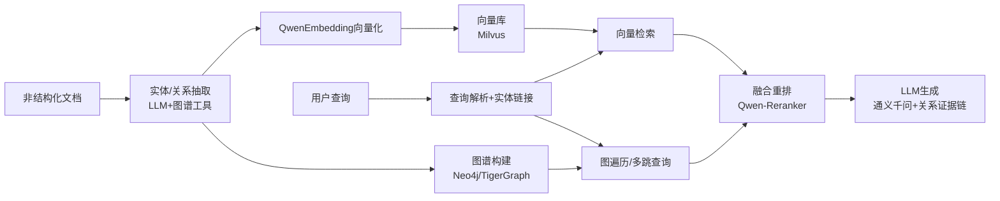

# 企业级RAG知识库系统 - 项目文档

> 项目名称：企业内部知识管理GraphRAG系统  
> 文档创建日期：2026-02-17  
> 当前阶段：需求分析与技术选型
> 架构类型：**GraphRAG（知识图谱+向量检索融合架构）**

---

## 📂 文档目录

| 序号 | 文档名称 | 状态 | 说明 |
|------|---------|------|------|
| 00 | [VibeCoding教程](./00-VibeCoding教程.md) | ✅ v1.0 | 项目规划过程教程文档 |
| 01 | [需求分析文档](./01-需求分析文档.md) | ✅ v1.1 | 项目背景、功能需求、非功能需求 |
| 02 | [技术选型文档](./02-技术选型文档.md) | ✅ v2.2 | 技术栈选型分析与决策（含量化评估矩阵、GraphRAG架构） |
| 03 | [系统架构设计文档](./03-系统架构设计文档.md) | ✅ v2.0 | GraphRAG系统架构、模块设计、接口设计 |
| 04 | [API接口设计文档](./04-API接口设计文档.md) | ✅ v1.0 | RESTful API接口规范、数据模型、认证授权 |
| 05 | [开发计划文档](./05-开发计划文档.md) | ✅ v1.0 | 模块开发顺序、任务分解、时间线、风险评估 |
| 06 | 部署运维文档 | ⏳ 待编写 | 部署方案、运维指南 |

---

## 📋 项目概览

### 项目目标

构建企业级GraphRAG知识库系统，实现：
- 📚 知识集中管理与智能检索
- 🕸️ 知识图谱构建与多跳推理
- 🤖 AI驱动的智能问答
- 🔐 安全可控的权限管理
- 📊 知识价值可视化

### 关键指标

| 指标 | 目标值 |
|------|--------|
| 文档规模 | 10万+ |
| 用户规模 | 1000+ |
| 图谱节点 | 千万级 |
| 检索命中率 | > 90% |
| 问答准确率 | > 90% |
| 响应时间 | < 3秒 |
| 系统可用性 | > 99.5% |

### 技术栈概览

```
┌─────────────────────────────────────────────────────────────┐
│  架构: GraphRAG (知识图谱 + 向量检索融合)                     │
│  前端: React 18 + Ant Design Pro                            │
│  后端: Spring Boot 3 (业务) + FastAPI (GraphRAG服务)        │
│  数据库: PostgreSQL + Milvus + Neo4j + Redis + MinIO        │
│  中间件: Kafka + APISIX + XXL-Job                           │
│  Embedding: Qwen-Embedding (阿里云/本地部署)                 │
│  Reranker: Qwen-Reranker (融合重排)                         │
│  LLM: Qwen2.5-Max (API) + Qwen2.5-72B (本地)               │
│  RAG框架: LlamaIndex + LangChain                            │
│  部署: Kubernetes (生产) + Docker Compose (开发)            │
│  云服务: 阿里云 (公有云) + 私有云 (核心数据)                  │
└─────────────────────────────────────────────────────────────┘
```

### GraphRAG核心架构



---

## 🗓️ 项目里程碑

| 阶段 | 时间 | 目标 | 状态 |
|------|------|------|------|
| 需求分析 | 第1周 | 完成需求文档 | ✅ 已完成 |
| 技术选型 | 第1周 | 确定技术栈 | ✅ 已完成 |
| 架构设计 | 第2周 | 完成架构设计 | ✅ 已完成 |
| MVP开发 | 第3-6周 | 核心功能实现 | ⏳ 待开始 |
| MVP测试 | 第7-8周 | 功能测试、优化 | ⏳ 待开始 |
| MVP上线 | 第9周 | 小范围试点 | ⏳ 待开始 |

---

## 📝 待办事项

### 当前阶段

- [x] 确认需求分析文档
- [x] 确认技术选型文档
- [x] 编写系统架构设计文档
- [x] 设计API接口规范
- [x] 编写开发计划文档
- [x] 评估GPU资源需求
- [x] 确定开发团队技术栈（Java）

### 下一阶段

- [x] 搭建开发环境
- [x] 开始MVP开发
- [x] 编写部署运维文档

---

## 👥 项目团队

| 角色 | 职责 | 人员 |
|------|------|------|
| 项目负责人 | 项目管理、资源协调 | TBD |
| 架构师 | 架构设计、技术决策 | TBD |
| 后端开发 | 服务端开发 | TBD |
| 前端开发 | 前端界面开发 | TBD |
| AI工程师 | GraphRAG Pipeline开发 | TBD |
| 测试工程师 | 测试用例、质量保障 | TBD |
| 运维工程师 | 部署运维 | TBD |

---

## 📞 联系方式

如有问题或建议，请联系项目负责人。

---

> 📝 **文档更新记录**
> 
> | 日期 | 版本 | 更新内容 | 更新人 |
> |------|------|---------|--------|
> | 2026-02-17 | v1.0 | 初始化项目文档 | - |
> | 2026-02-17 | v1.1 | 更新为GraphRAG架构 | - |
